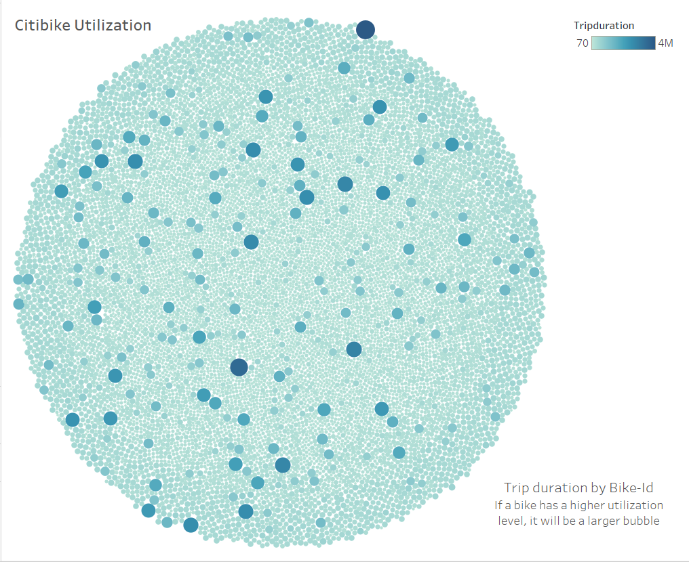
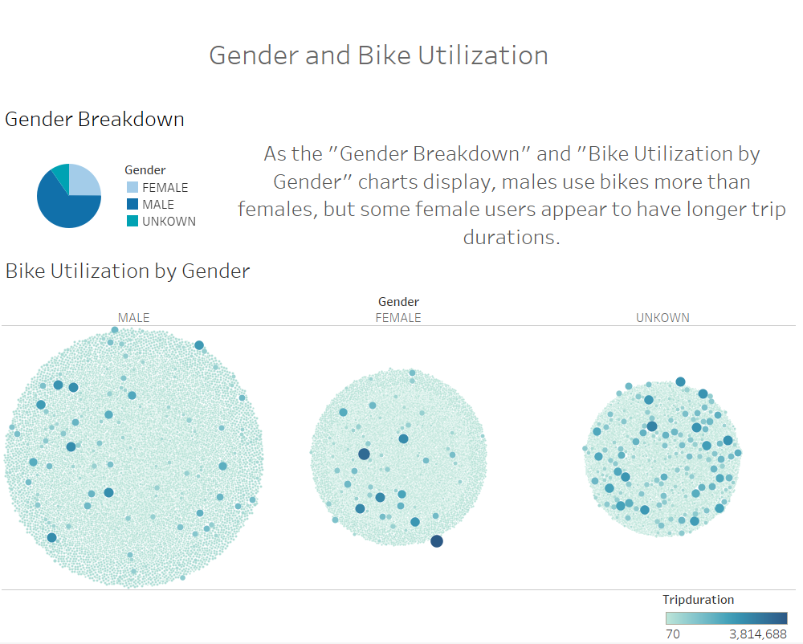
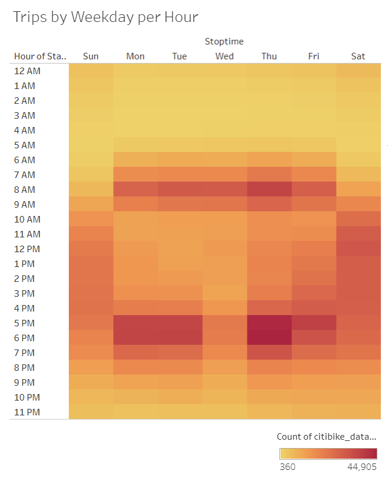
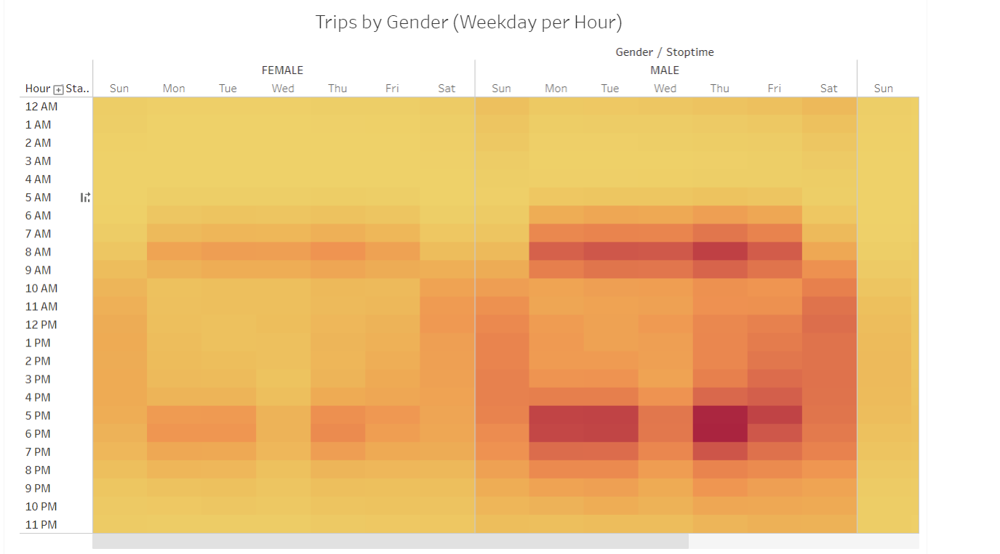
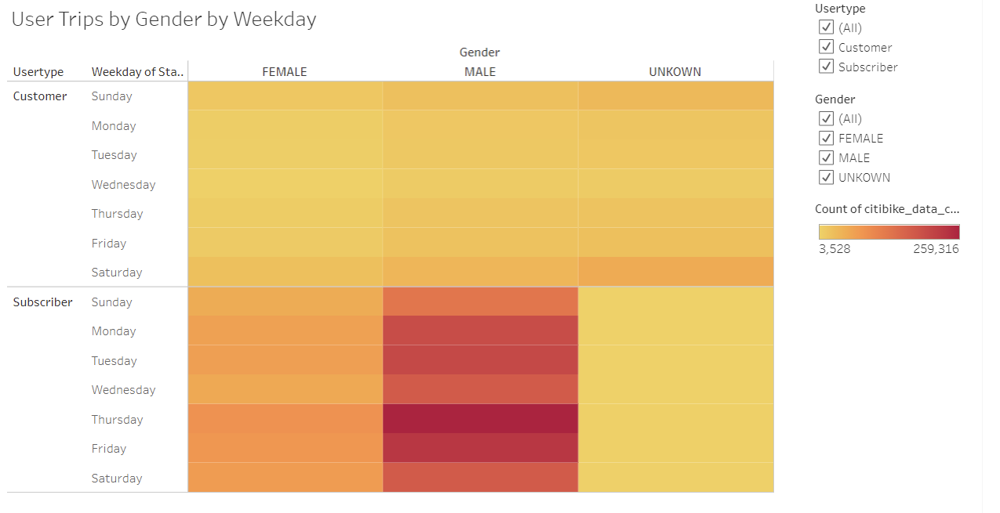
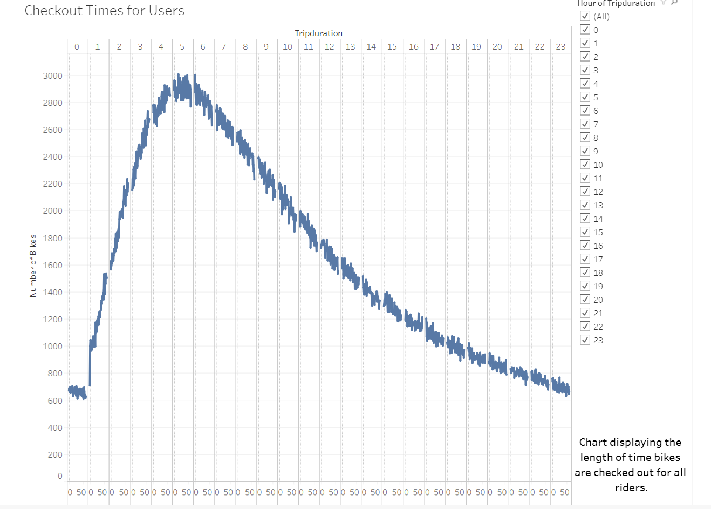
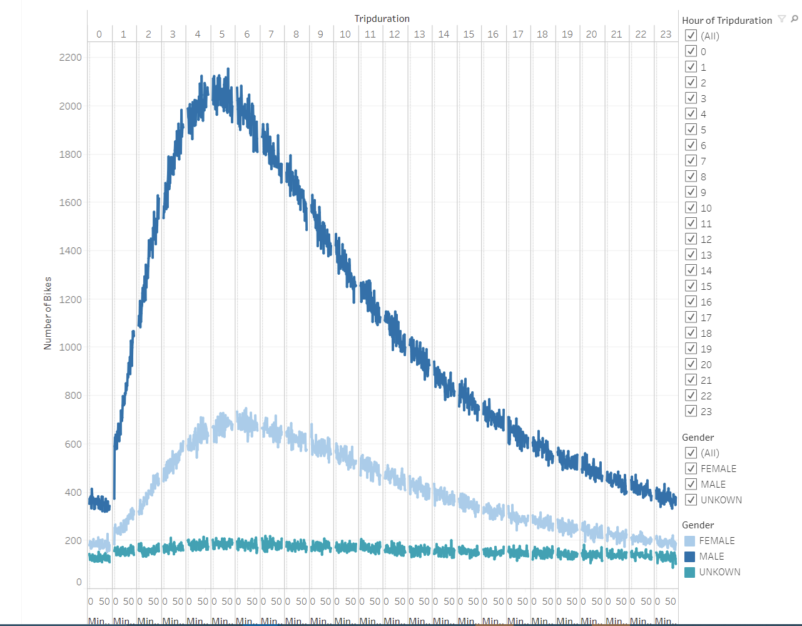

# Bikesharing Analysis

## Project Overview

This project uses the program Tableau to visualize and analyze bike-sharing data from New York City.

### Purpose

The purpose of this project is to use Tableau to create visualizations for this NYC Citibike analysis and draw conclusions investors might want to know before deciding whether to invest in bike-share startups in other locations.

## Resources

- Tableau Public or Tableau Desktop
- [Citi Bike System Data](https://public.tableau.com/profile/tabitha.mueller#!/vizhome/Challenge_16030759364100/CitiBikeAnalysis?publish=yes)
  - `201908-citibike-tripdata.csv.zip`
- Jupyter Notebook and Pandas
  - used to convert datetime data

## Results

A presentation containing the visualizations from this analysis are available at this [link](https://public.tableau.com/profile/tabitha.mueller#!/vizhome/Challenge_16030759364100/CitiBikeAnalysis?publish=yes).

The analysis and visualizations lead to the following conclusions:

- Visualization of trip duration by bike-id shows that Citibikes are used to travel varying distances within New York City and that making bikes available in various parts of the city and at varying distances is vital to meeting both longer and shorter distance needs.
  
  

- As far as bike utilization by gender and trip duration, the following visualization shows that more male-identifying users rode Citi Bikes than female-identifying users, but female-identifying users appear to have long trip durations as well. Though we don't have information on users who did not report gender, the size of the group shows that there are some unanswered questions and it is important not to draw too many conclusions about gender and bike utilization until more statistical analyses are run.
  
  

- The heat map-style chart below displays bike trips by weekday per hour. 
  In the morning, the highest hours of use were from roughly 6 a.m. to 9 a.m. and in the evening the most use occured from 5 p.m. to 7 p.m.
   These hours align with when commuters are heading to work. However, Saturday and Sunday show steady use between 9 a.m. and 7 p.m. when families and individuals might be running errands or spending time with one another.
   Use during the weekday and on the weekend show that there is a consistent demand for rideshares.

   

- Analysis of weekday trips per hour by gender supports the conclusions drawn from the previous heat map.
  Additionally, the breakdown by gender indicates that users ride bikes around the same time, regardless of gender.

  

- A breakdown of user trips by gender by weekday show that subscribers use the bikes more than non-subscribers for both female and male identifying users, but the trend seems to shift for users whose gender is unknown. More analysis is necessary to understand why this might be the case.
  
  

- A chart displaying the length of time bikes are checked out shows that most users use bikes for trips lasting about 5 hours.
  
  

- More male identifying users appear to use bikes for longer trip durations than female identifying users or users whose gender is not identified. The peak use for both male and female identifying users is around 5-6 hours (5 for males, 6 for females).
  
    
  
  

## Summary

The results of the analysis, available on this [Tableau Story](https://public.tableau.com/profile/tabitha.mueller#!/vizhome/Challenge_16030759364100/CitiBikeAnalysis?publish=yes), display that bikes are frequently used in the city and there is a market for bike rideshares in urban environments. 
However, more analysis is needed and questions remain about the statistical significance of some of the observations made in the results section.

Recommendations for future analysis:
1.  An analysis of population density and bike use would be helpful for beginning to figure out where bike stations should be placed. This analysis could be a map showing population density and which bike sites were used the most frequently.
2.  Maps showing top starting and ending locations and analysis of why these locations are frequent would also be helpful.
3.  Statistical analyses looking into correlation vs. causation and statistical significance is necessary to draw more concrete conclusions and solidify or disprove observations made in the results section.
4.  Finally, an analysis of how long bikes last and the cost to repair/replace them would be helpful for investors. This could look like an analysis of bike use (total trips made, total miles ridden etc.) before the bike broke down or was retired.